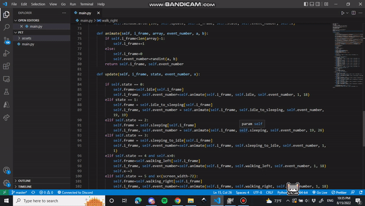

# Desktop-Cat
A desktop kitty that sleeps, wanders around, and keeps you company

## Features
- a basic tkinter app
- randomly chooses actions
- animation/ sprite management

## Improvements 
- make it interactive, check for mouse events, etc.
- can be easily extended to a whole desktop pet program with simple oop and some gui

## Run Instructions
- open the root folder where the project is installed and run ``py main.py``

## Demo

